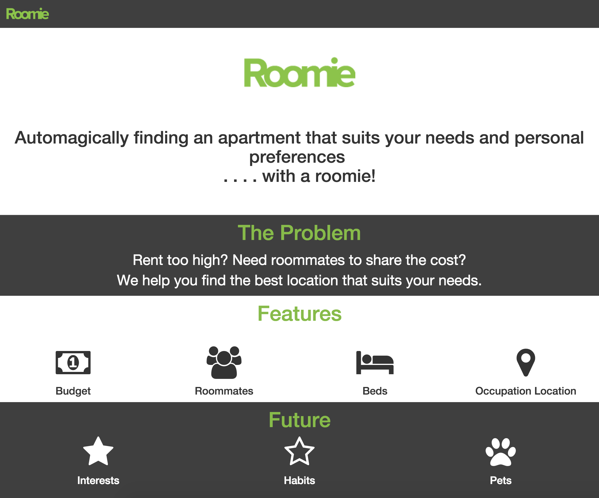

# Roomie

Roomie finds you an apartment to sublet with other people based on your preferences. Roomie, with its rank algorithm, provides you with the best apartments based on your work location, budget, number of rooms and number of roommates.

# Team

Roomie is a web application that had been developed during the [CarnegieApps Hackathon 16’](http://carnegieapps.com). We were lucky to have a great team consisting of [John Naguib](https://github.com/jnaguib) (Backend Ninja), [Zehni Khairullah](https://github.com/zehni) (UI Freak), [Naassih Gopee](https://github.com/nogarithm) (Algorithms Pro), and [Mahmoud Alismail](https://github.com/mahmoudalismail) (API Hacker).

# Motivation

We have found out that there are a lot of people in Doha, Qatar (and maybe in other spots in the world) are always looking to sublet an apartment. Many of those people are looking to sublet with a roommate to either split the cost or, if they are new to the country, get to know people. We felt that this is a potential problem we could address with Roomie.

# How to run

```bash
$ ./runserver
```
Go to `localhost:3000` in your browser and find an apartment.

# Screenshots

### Homepage



# Stack

We have used the following technologies:

- Express
- Google Maps API (had been heavily used)
- Bootstrap
- Noun Project
- Digital Ocean
- We will include anything we are missing here...

# Technical Challenges

The main technical challenge we faced was trying to extract traffic information to find the most realistic home to work ETA. We were not successful in finding any online data or API that could provide us with real-time traffic data or trip ETA. However, we were able to solve the problem and provide a pretty realistic ETA. Our solution was to find the home to work distance, using the shortest path, then estimate the ETA given the driving speed limit and time of the day. We compared the estimated ETA against Google Maps's ETA (the Maps application found on smart phones) and we were slightly off by ~5 minutes. (This comparison was done once around 8AM on a weekend).

# What we learned

The learning curve was pretty steep and there are the main learning outcomes:

- Try to always find an alternative if you cannot do what initially needed to do (finding traffic data)
- Manage three people working on the same frontend code (you split the work into completely different files, under different branches and you give all the work to Mahmoud to merge it)
- Have realistic expectations for a project that needs to be done in 24 hours or maybe less!
- Try to finish heavy/challenging work in the early hours of the hackathon before its too late and you can't stay awake
- Drink a lot of coffee (even if you don't drink coffee, its good to do something different) and try to have a great time!

# Future Work

We hope that we could expand on this project and do the following:

- Better estimate the home to work ETA
- Search for apartments based on nearby services such as parks and hospitals
- Put everything together to train the computer to recommend the best apartments based on your preferences (of course we will need to ask for more than your budget!)

Please talk to us if you find this project is of your interest and would like to do something with it. We are always happy to hear your thoughts!

# License

This project is licensed under MIT and the license is found inside the LICENSE file.

This project is only a prototype and has never been officially or unofficially used by people to look for apartments.